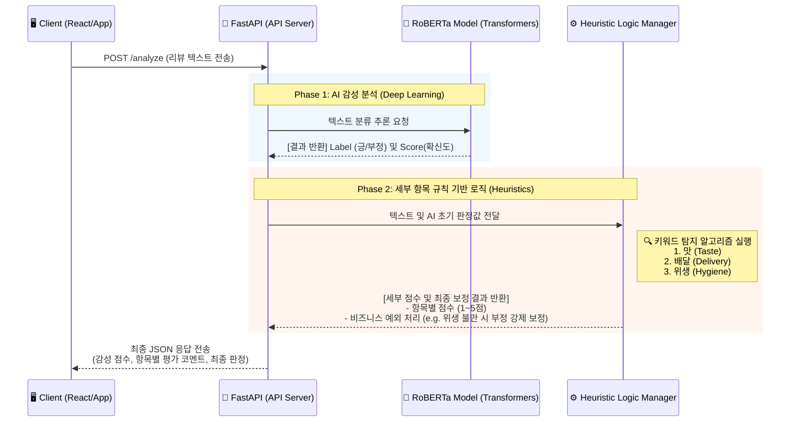

# 🏗️ 배달 음식 리뷰 감성 분석 시스템 아키텍처 (my-chatbot)

본 문서는 `my-chatbot` 프로젝트의 백엔드 파이프라인(`review.py`)을 중심으로 시스템의 구조와 기술적 특징을 설명합니다.

---

## 1. 시스템 개요 (Overview)
본 시스템은 사용자가 작성한 배달 음식 리뷰 텍스트를 입력받아, **AI 딥러닝 기반의 텍스트 분류(Text Classification)**와 **비즈니스 규칙 기반(Heuristics)의 세부 항목 분석**을 결합하여 빠르고 정확하게 리뷰의 긍정/부정 여부 및 항목별 점수를 반환하는 **하이브리드 분석 API 서비스**입니다.

## 2. 딥러닝 모델 파인튜닝 성과 (Fine-tuning & Data Engineering)

본 프로젝트의 최대 핵심 경쟁력은 직접 배달 도메인에 맞추어 커스텀 파인튜닝(Fine-tuning)한 모델(`ju03/Chatbot_Emotion-classification`)을 사용했다는 점입니다.

*   **베이스 모델 (Base Model):** Hugging Face **RoBERTa** 모델
*   **학습 데이터 (Dataset):** 국내 3대 배달 어플(배달의민족, 요기요, 쿠팡이츠) 크롤링 리뷰 데이터
*   **데이터 라벨링 (Labeling):** 1점~2점: 부정(Negative) / 4점~5점: 긍정(Positive) 으로 이진 분류 구축
*   **하이퍼파라미터 (Hyperparameters):**
    *   학습률 (Learning Rate): `0.00002`
    *   반복 횟수 (Epochs): `3`
    *   조기 종료 조건 (Early Stopping): `2`
    *   손실 함수 (Loss Function): `Cross-Entropy Loss` (클래스 간 오차 최적화)
*   **최종 성능 (Performance):** 배달 도메인 특화 리뷰 데이터에 대해 **약 95% 수준의 높은 감성 분류 정확도(Accuracy)** 달성

## 3. 주요 아키텍처 다이어그램 (Flow Chart)

## 4. 핵심 기술 스택 및 계층 구조 (Tech Stack & Layers)

### 🚀 1. 딥러닝 모델 계층 (Model Layer)
- **프레임워크:** Hugging Face `transformers`
- **사용 모델:** 직무 특화 파인튜닝된 RoBERTa 기반 모델 (`ju03/Chatbot_Emotion-classification`)
- **역할:** 사람의 개입 없이 문맥의 전반적인 감성을 파악하고 수학적 확신도(`score`)와 기학습된 라벨(`LABEL_1`)을 도출합니다. (95% 정확도)

### ⚙️ 2. 비즈니스 로직 계층 (Business Logic Layer)
- **방식:** Heuristic Keyword Matching (규칙 기반 매칭)
- **핵심 기능:**
  - AI 모델에 한계가 있는 구체적인 징후 파악을 보완합니다.
  - 리뷰 문장에서 **'맛', '배달(속도)', '위생'** 세 가지 핵심 도메인 키워드를 추출하여 독립적인 서브 스코어(1~5점)를 계산합니다.
  - **안전장치(Fail-safe):** AI가 전반부를 보고 '긍정'으로 판단했더라도, "벌레", "머리카락" 등 치명적인 위생 관련 단어가 감지되면 최종 판정을 '부정'이나 '애매' 상태로 강력하게 덮어쓸 수 있도록 섬세하게 짜인 비즈니스 룰 예외 처리(Exception Handling)를 담당합니다.

### 🔌 3. API 서빙 계층 (API Serving Layer)
- **프레임워크:** `FastAPI` (Python)
- **통신 / 보안:** `CORSMiddleware` 적용을 통한 프론트엔드 연동 지원
- **데이터 검증:** `Pydantic`(`BaseModel`)을 활용한 입출력 데이터 타입 보호 및 유효성 검사

---

## 💡 요약 (Summary)
이 프로젝트는 단순히 범용 AI API를 가져다 쓴 것이 아니라, **1) 실제 배달 도메인 데이터를 크롤링하고 파인튜닝하여 자체 딥러닝 모델(RoBERTa, 95% 정확도)을 구축**하였으며, **2) AI의 오판을 실무적인 규칙(Rule-based)으로 보완하는 하이브리드 아키텍처**를 성공적으로 구현해낸 완성도 높은 AI 백엔드 시스템입니다.
